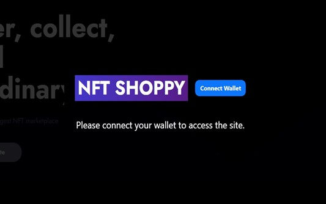
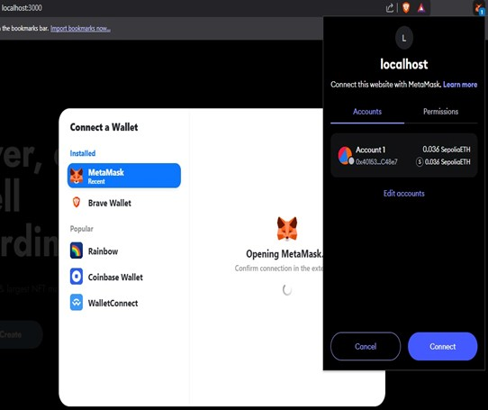
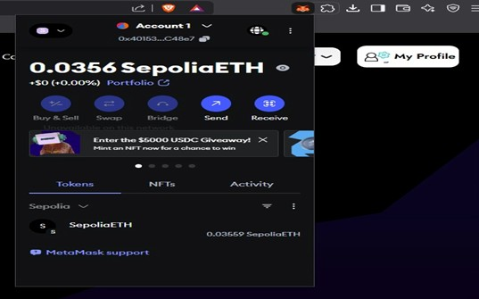
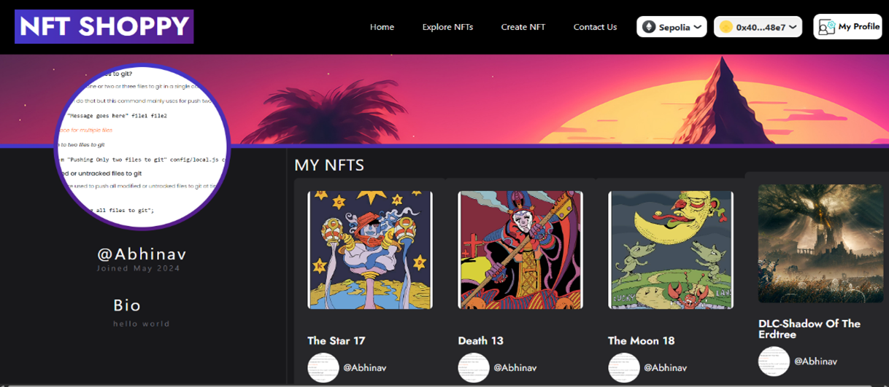
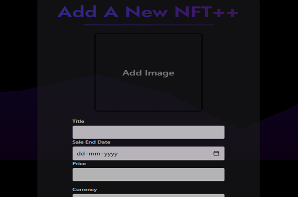
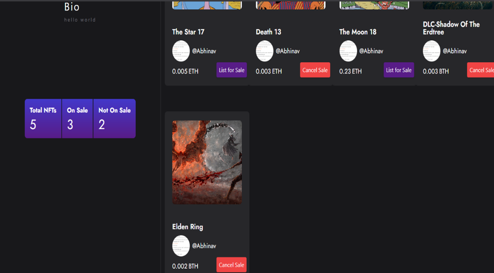
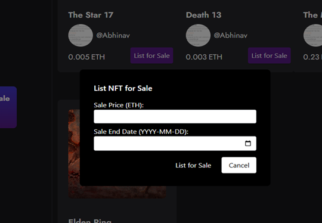
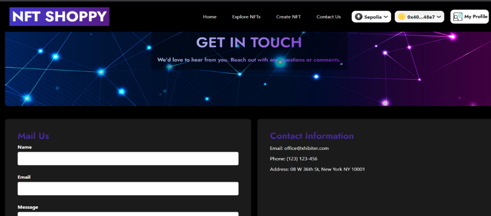
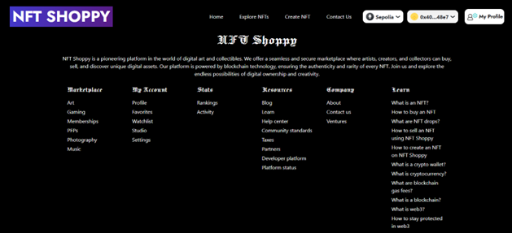

# NFT Marketplace DApp (Web3)

A fully functional **Decentralized Fixed-Price NFT Marketplace** built using **Next.js, Tailwind CSS, Solidity and Ethereum**.

This project was developed during my internship at **Redblox Technologies Pvt. Ltd.** and simulates a real-world Web3 NFT trading platform with secure wallet-based authentication.

---

## Features

- MetaMask Wallet Authentication
- Create & Mint NFTs
- List NFTs for Sale (Fixed Price)
- Buy NFTs using Smart Contracts
- User Profile Management
- Real-Time Blockchain Transaction Status
- Ethereum Smart Contract Integration

---

## Tech Stack

### Frontend
- Next.js
- React.js
- Tailwind CSS
- RainbowKit
- Wagmi
- Ethers.js

### Blockchain
- Solidity
- Ethereum (Testnet)
- ERC-721 Standard
- Hardhat / Truffle

### Storage
- JSON Metadata
- IPFS (for NFT Media Storage)

---

## How It Works

1. User connects MetaMask wallet.
2. Wallet address acts as user authentication.
3. Seller creates an NFT with:
   - Title
   - Description
   - Image
   - Fixed price
4. NFT is listed on the marketplace.
5. Buyer clicks **Buy Now**.
6. Smart contract:
   - Verifies ownership
   - Transfers NFT ownership
   - Transfers payment to the seller
7. Transaction is recorded on the blockchain.

---

# Getting Started

Follow the steps below to run the project locally.

---

```bash

1️. Clone the Repository
git clone https://github.com/Nabeel1401/Nft-App.git
cd Nft-App


2. Install Dependencies
- npm install

3️. Install Required Web3 Packages
- npm install next@latest react@latest react-dom@latest
- npm install @rainbow-me/rainbowkit wagmi viem @tanstack/react-query
- npm install formik yup
- npm install formidable
- npm install ethers@5.6.4

4️. Run Development Server
- npm run dev

After running the server, open:

http://localhost:3000
```
## Application Screenshots

---

### Landing Experience

<p align="center">
  
</p>

---

### Wallet Authentication Flow

<p align="center">
  
  
</p>

<p align="center">
  
</p>

---

### User Profile & NFT Dashboard

<p align="center">
  
</p>

---

### NFT Creation & Listing

<p align="center">
  
  
</p>

<p align="center">
  
</p>

---

### Additional Pages

<p align="center">
  
  
</p>
